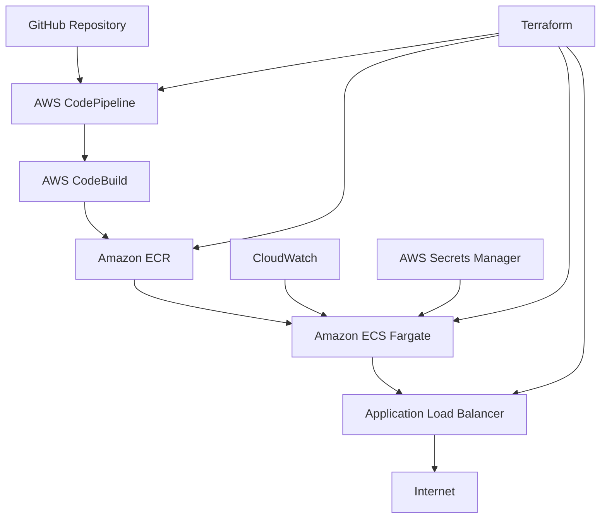

# 🚀 Menteebot CI/CD Demo

[](https://github.com/haimc/menteebot-cicd-demo/actions)
[](https://github.com/haimc/menteebot-cicd-demo/actions)
[](https://opensource.org/licenses/MIT)

A comprehensive DevOps CI/CD pipeline demonstration project showcasing modern cloud-native practices with AWS services, Docker containerization, and automated deployment strategies.

## 📋 Table of Contents

- [Overview](#overview)
- [Architecture](#architecture)
- [Quick Start](#quick-start)
- [Project Structure](#project-structure)
- [CI/CD Pipeline](#cicd-pipeline)
- [AWS Infrastructure](#aws-infrastructure)
- [Security](#security)
- [Monitoring](#monitoring)
- [Development](#development)
- [Deployment](#deployment)
- [Contributing](#contributing)
- [License](#license)

## 🎯 Overview

This project demonstrates a complete DevOps CI/CD pipeline for a Python microservice with the following features:

- **Automated CI/CD Pipeline** with AWS CodePipeline
- **Container Orchestration** using Amazon ECS Fargate
- **Infrastructure as Code** with Terraform
- **Security Scanning** and vulnerability management
- **Monitoring & Observability** with CloudWatch
- **Blue-Green Deployments** for zero downtime
- **Semantic Versioning** with automated releases

## 🏗️ Architecture

### High-Level Architecture



### Technology Stack

- **Application**: Python 3.11 + Flask
- **Containerization**: Docker + Multi-stage builds
- **Orchestration**: Amazon ECS Fargate
- **CI/CD**: AWS CodePipeline + CodeBuild
- **Registry**: Amazon ECR
- **Infrastructure**: Terraform + CloudFormation
- **Monitoring**: CloudWatch + X-Ray
- **Security**: AWS IAM + Secrets Manager

## 🚀 Quick Start

### Prerequisites

- AWS CLI configured with appropriate permissions
- Docker Desktop installed
- Python 3.11+
- Terraform 1.5+
- Git

### Local Development Setup

1. **Clone the repository**
   ```bash
   git clone https://github.com/haimc/menteebot-cicd-demo.git
   cd menteebot-cicd-demo
   ```

2. **Install dependencies**
   ```bash
   pip install -r requirements.txt
   pip install -r requirements-dev.txt
   ```

3. **Run locally with Docker**
   ```bash
   docker-compose up --build
   ```

4. **Access the application**
   - Main endpoint: http://localhost:8080
   - Health check: http://localhost:8080/health
   - Version info: http://localhost:8080/version

### AWS Infrastructure Deployment

1. **Configure AWS credentials**
   ```bash
   aws configure
   ```

2. **Deploy infrastructure**
   ```bash
   cd infrastructure/terraform/environments/dev
   terraform init
   terraform plan
   terraform apply
   ```

3. **Deploy application**
   ```bash
   make deploy
   ```

## 📁 Project Structure

```
menteebot-cicd-demo/
├── src/                          # Application source code
│   ├── hello_world.py           # Main Flask application
│   ├── version.py               # Version management
│   └── health_check.py          # Health check endpoints
├── docker/                      # Docker configuration
│   ├── Dockerfile               # Multi-stage Docker build
│   ├── .dockerignore            # Docker build context
│   └── docker-compose.yml       # Local development
├── infrastructure/              # Infrastructure as Code
│   ├── terraform/               # Terraform configurations
│   │   ├── environments/        # Environment-specific configs
│   │   ├── modules/             # Reusable Terraform modules
│   │   └── shared/              # Shared infrastructure
│   └── cloudformation/          # CloudFormation templates
├── .github/                     # GitHub Actions workflows
│   └── workflows/
│       ├── ci-cd.yml           # Main CI/CD pipeline
│       ├── security-scan.yml   # Security scanning
│       └── release.yml         # Release automation
├── scripts/                     # Automation scripts
│   ├── build.sh                # Build automation
│   ├── deploy.sh               # Deployment scripts
│   └── version-bump.sh         # Version management
├── docs/                        # Documentation
│   ├── ARCHITECTURE.md         # Architecture decisions
│   ├── DEPLOYMENT.md           # Deployment guide
│   └── RUNBOOK.md              # Incident response
├── tests/                       # Test suites
│   ├── unit/                   # Unit tests
│   ├── integration/            # Integration tests
│   └── e2e/                    # End-to-end tests
├── monitoring/                  # Monitoring configuration
│   ├── dashboards/             # CloudWatch dashboards
│   └── alerts/                 # Alert configurations
├── README.md                   # This file
├── requirements.txt            # Python dependencies
├── requirements-dev.txt        # Development dependencies
├── version.txt                 # Current version
├── .terraform-version          # Terraform version
├── .python-version             # Python version
└── Makefile                    # Build automation
```

## 🔄 CI/CD Pipeline

### Pipeline Stages

1. **Source Stage**
   - GitHub webhook trigger on main branch
   - Code checkout and version detection
   - Artifact preparation

2. **Build Stage**
   - Docker image building with security scanning
   - Unit and integration testing
   - Code quality checks

3. **Deploy Stage**
   - ECR image push with version tagging
   - ECS service deployment
   - Health check validation

### Versioning Strategy

- **Semantic Versioning**: Major.Minor.Patch (e.g., 1.0.0)
- **Automated Bumping**: Based on commit message types
- **Git Tags**: Automatic tag creation for releases
- **ECR Tags**: Version and latest tags for images

### Pipeline Triggers

- **Push to main**: Full CI/CD pipeline
- **Pull Request**: Security scanning and testing
- **Tag creation**: Production deployment

## ☁️ AWS Infrastructure

### Core Services

- **AWS CodePipeline**: CI/CD orchestration
- **AWS CodeBuild**: Container building and testing
- **Amazon ECR**: Container registry
- **Amazon ECS Fargate**: Serverless container orchestration
- **Application Load Balancer**: Traffic management
- **CloudWatch**: Monitoring and observability
- **AWS Secrets Manager**: Secrets management
- **IAM**: Identity and access management

### Infrastructure as Code

- **Terraform**: Main infrastructure provisioning
- **CloudFormation**: AWS-specific resources
- **Environment Separation**: Dev, staging, production
- **Modular Design**: Reusable infrastructure components

## 🔒 Security

### Security Measures

- **Container Security**: Vulnerability scanning with Trivy
- **Code Security**: SAST with CodeQL
- **Infrastructure Security**: IAM least privilege access
- **Network Security**: VPC with private subnets
- **Secrets Management**: AWS Secrets Manager
- **Encryption**: TLS 1.3, EBS encryption

### Compliance

- **Security Scanning**: Automated vulnerability assessment
- **Policy as Code**: Open Policy Agent integration
- **Audit Logging**: CloudTrail for all API calls
- **Access Reviews**: Regular IAM access reviews

## 📊 Monitoring

### Three Pillars of Observability

1. **Metrics (CloudWatch)**
   - Golden Signals: Latency, Traffic, Errors, Saturation
   - Infrastructure metrics: CPU, Memory, Disk, Network
   - Application metrics: Response times, throughput

2. **Logs (CloudWatch Logs)**
   - Application logs with structured JSON
   - Access logs from ALB
   - System logs from ECS

3. **Traces (X-Ray)**
   - Distributed tracing across services
   - Performance analysis and bottleneck identification

### Alerting

- **CloudWatch Alarms**: Automated alerting
- **SNS Topics**: Team notification routing
- **Escalation Procedures**: Incident response automation
- **SLI/SLO Monitoring**: Service level objectives

## 💻 Development

### Local Development

```bash
# Start development environment
make dev

# Run tests
make test

# Run security scan
make security-scan

# Build Docker image
make build
```

### Code Quality

- **Linting**: flake8, black, isort
- **Testing**: pytest with coverage
- **Security**: Bandit, Safety
- **Documentation**: Sphinx, docstring coverage

### Git Workflow

1. **Feature Branch**: Create feature branch from main
2. **Development**: Implement feature with tests
3. **Pull Request**: Create PR with description
4. **Review**: Code review and security scan
5. **Merge**: Merge to main after approval

## 🚀 Deployment

### Deployment Strategies

- **Blue-Green Deployment**: Zero-downtime deployments
- **Canary Releases**: Gradual traffic shifting
- **Rollback Capability**: Automated rollback on failure
- **Health Checks**: Automated health validation

### Environment Promotion

1. **Development**: Automated deployment on push
2. **Staging**: Manual promotion with testing
3. **Production**: Manual approval with rollback capability

### Deployment Commands

```bash
# Deploy to development
make deploy-dev

# Deploy to staging
make deploy-staging

# Deploy to production
make deploy-prod

# Rollback deployment
make rollback
```

## 🤝 Contributing

### Contribution Guidelines

1. **Fork the repository**
2. **Create a feature branch**
3. **Make your changes**
4. **Add tests and documentation**
5. **Submit a pull request**

### Development Standards

- **Code Style**: Follow PEP 8 and project conventions
- **Testing**: Maintain >90% test coverage
- **Documentation**: Update docs for all changes
- **Security**: Pass all security scans

### Pull Request Process

1. **Description**: Clear description of changes
2. **Testing**: All tests must pass
3. **Security**: Security scan must pass
4. **Review**: At least one approval required
5. **Merge**: Squash and merge to main

## 📄 License

This project is licensed under the MIT License - see the [LICENSE](LICENSE) file for details.

## 📞 Support

- **Documentation**: [Project Wiki](https://github.com/haimc/menteebot-cicd-demo/wiki)
- **Issues**: [GitHub Issues](https://github.com/haimc/menteebot-cicd-demo/issues)
- **Discussions**: [GitHub Discussions](https://github.com/haimc/menteebot-cicd-demo/discussions)
- **Email**: haim@haimc.xyz

## 🙏 Acknowledgments

- AWS for cloud infrastructure services
- HashiCorp for Terraform
- Docker for containerization
- The open-source community for tools and libraries

---

**Author**: Haim Cohen  
**Website**: https://haimc.xyz  
**LinkedIn**: https://www.linkedin.com/in/haimc/  
**Last Updated**: 2025-01-27 